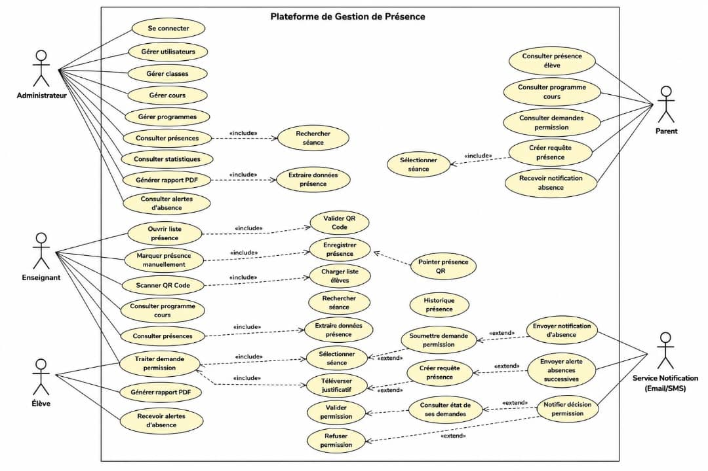
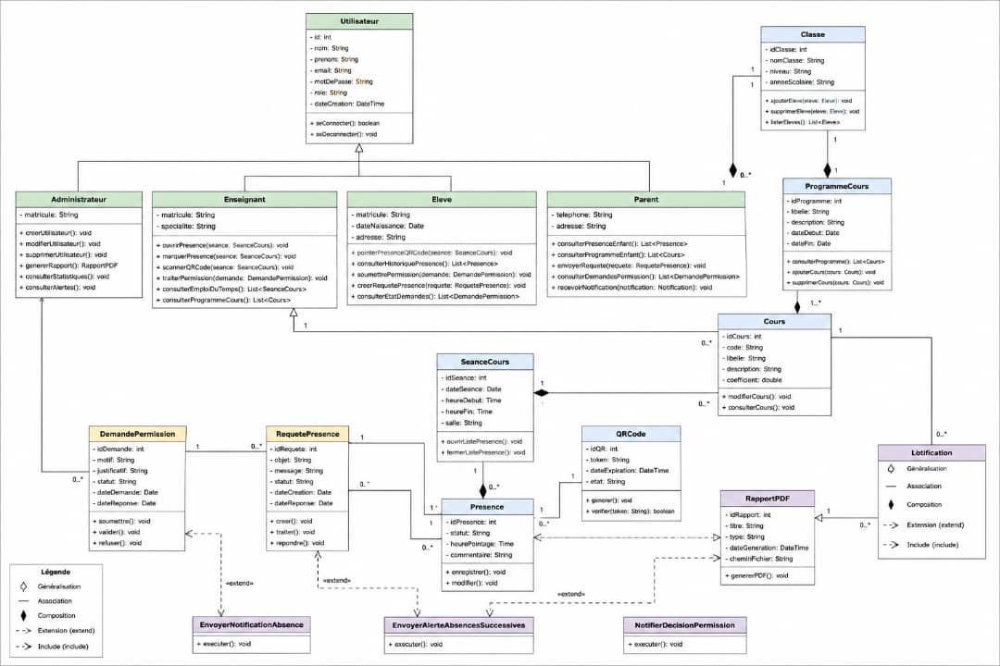

# Plateforme de Gestion de Presence Scolaire

Application web complete pour gerer la presence des eleves en milieu scolaire. Le projet est organise en monorepo avec un frontend React, un backend Laravel et une base MySQL/MariaDB.

## Apercu

La plateforme couvre les besoins principaux du sujet :

- authentification par role : admin, professeur, parent et eleve ;
- ouverture d'une liste de presence ;
- marquage de presence manuel ou par QR Code ;
- gestion des classes, eleves, cours et programmes ;
- suivi des absences et notifications aux parents ;
- gestion des requetes de presence ;
- gestion des permissions d'absence ;
- generation de rapports de presence au format PDF ;
- tableaux de bord adaptes a chaque role.

## Structure

```text
Projet-Web-4/
+-- backend/                    API REST Laravel 11
+-- platform-gestion-presence/   Frontend React + Vite
+-- database/                    Notes SQL et connexion MySQL
+-- ui-design/                   Charte UI et design tokens
+-- README.md                    Documentation principale
```

## Stack

Frontend :

- React 19 + Vite
- React Router
- Axios
- Zustand
- Tailwind CSS
- Recharts
- lucide-react
- qrcode.react / html5-qrcode
- jsPDF / html2canvas

Backend :

- Laravel 11
- PHP 8.2+
- Laravel Sanctum
- MySQL/MariaDB
- DomPDF
- Simple QRCode

## Prerequis

- PHP 8.2 ou plus
- Composer
- Node.js + npm
- XAMPP, Laragon ou MySQL/MariaDB
- Extensions PHP utiles : `pdo_mysql`, `zip`, `gd`

## Base de donnees

Base utilisee :

```text
gestion_presence
```

Creation avec XAMPP sous Windows :

```powershell
& 'C:\xampp\mysql\bin\mysql.exe' -u root -e "CREATE DATABASE IF NOT EXISTS gestion_presence CHARACTER SET utf8mb4 COLLATE utf8mb4_unicode_ci;"
```

Configuration Laravel attendue dans `backend/.env` :

```env
DB_CONNECTION=mysql
DB_HOST=127.0.0.1
DB_PORT=3306
DB_DATABASE=gestion_presence
DB_USERNAME=root
DB_PASSWORD=
```

Voir aussi [database/README.md](database/README.md).

## Installation backend

```bash
cd backend
composer install
php artisan key:generate
php artisan migrate --seed
php artisan storage:link
```

Lancer l'API :

```bash
php artisan serve --host=0.0.0.0 --port=8000
```

URL API :

```text
http://localhost:8000/api/v1
```

## Installation frontend

```bash
cd platform-gestion-presence
npm install
```

Fichier `.env` :

```env
VITE_API_URL=http://localhost:8000/api
VITE_USE_MOCK_API=false
```

Lancer le frontend :

```bash
npm run dev
```

URL locale :

```text
http://localhost:5173
```

Pour tester sur telephone, lancer Vite et Laravel avec `--host=0.0.0.0`, puis ouvrir l'IP locale du PC affichee par Vite.

## Comptes de test

```text
admin@test.com   / password
prof@test.com    / password
parent@test.com  / password
eleve@test.com   / password
```

## Donnees de test riches

Un script permet d'ajouter un jeu de donnees plus complet pour rendre les interfaces plus interessantes :

```bash
cd backend
php scripts/seed-rich-presence-data.php
```

Le jeu de donnees ajoute notamment :

- plusieurs classes ;
- plusieurs professeurs, parents et eleves ;
- des cours par classe ;
- des sessions de presence ;
- des presences presentes, absentes et en retard ;
- des notifications ;
- des requetes ;
- des permissions d'absence.

Un script plus petit existe aussi :

```bash
php scripts/insert-demo-data.php
```

## Tests

Backend :

```bash
cd backend
php artisan test
```

Frontend :

```bash
cd platform-gestion-presence
npm run build
npm run lint
```

## Captures de l'application

### Connexion


### Tableau de bord admin


### Tableau de bord professeur


### Tableau de bord parent


### Tableau de bord eleve


### Gestion des cours


### Gestion des eleves


### Liste de presence


### Scan QR Code


### Requetes


### Permissions


### Notifications


### Rapports


### Base de donnees


## Diagrammes

### Diagramme de Cas d'Utilisation



Ce diagramme presente les interactions entre les differents acteurs du systeme (Admin, Professeur, Parent, Eleve) et les cas d'utilisation principaux : authentification, gestion des presence, consultation des rapports, gestion des permissions et requetes.

### Diagramme de Classes



Ce diagramme illustre l'architecture objet du projet et les relations entre les principales entites : Utilisateur, Classe, Cours, Presence, Session, Notification, Permission et Requete. Il montre les associations, heritage et dependances entre les differentes classes du systeme.

## Endpoints principaux

```text
POST   /api/v1/login
POST   /api/v1/logout
GET    /api/v1/me
GET    /api/v1/dashboard/stats

GET    /api/v1/classes
GET    /api/v1/eleves
GET    /api/v1/cours
GET    /api/v1/cours/programme/{classeId}

GET    /api/v1/sessions
POST   /api/v1/sessions
POST   /api/v1/sessions/{id}/cloturer
GET    /api/v1/sessions/{id}/qr-token

GET    /api/v1/presences
POST   /api/v1/presences/scan-qr
POST   /api/v1/presences/marquer-liste

GET    /api/v1/notifications
GET    /api/v1/requetes
POST   /api/v1/requetes
PATCH  /api/v1/requetes/{id}/traiter

GET    /api/v1/permissions
POST   /api/v1/permissions
PATCH  /api/v1/permissions/{id}/statut

GET    /api/v1/rapports/preview
GET    /api/v1/rapports/pdf
```

## Design

La charte visuelle est documentee dans [ui-design/README.md](ui-design/README.md).

Principes actuels :

- couleur principale : `#E8002D` ;
- interface claire rouge, blanc et gris ;
- sidebar par role ;
- composants reutilisables : Button, Card, Table, Badge, StatCard, EmptyState ;
- pages differenciees pour admin, professeur, parent et eleve.

## Etat actuel

Le frontend est connecte au backend Laravel via `VITE_API_URL`. Les donnees sont stockees dans MySQL et visibles dans les interfaces apres connexion. Le mode mock existe encore pour depannage avec :

```env
VITE_USE_MOCK_API=true
```

Par defaut, le projet utilise l'API Laravel reelle.
